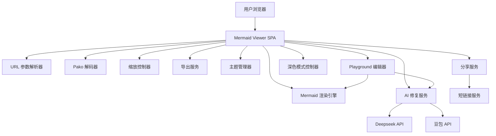
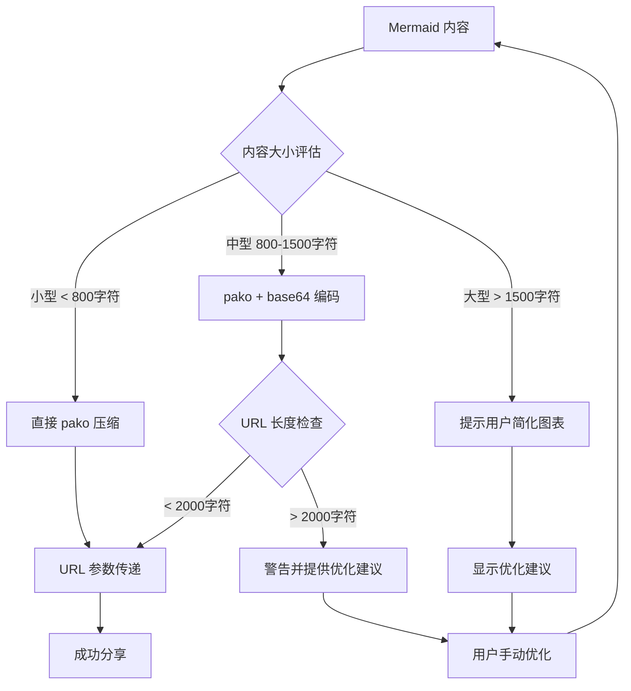
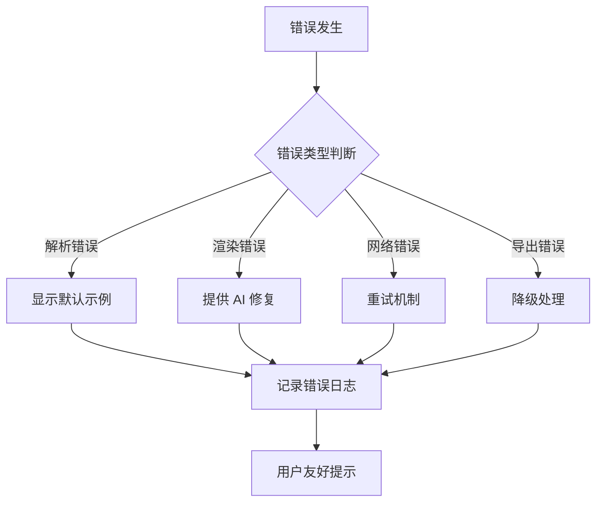

# Design Document

## Overview

本设计文档描述了 Mermaid 图表展示网页的技术架构和实现方案。该系统是一个单页面应用（SPA），支持通过 URL 参数接收 pako 压缩编码的 Mermaid 内容，提供图表渲染、交互操作、导出功能和 AI 辅助等特性。

## Architecture

### 系统架构图



### 技术栈选择

基于 [ai-starter-nextjs-shadcnui](https://github.com/hifizz/ai-starter-nextjs-shadcnui) 脚手架：

- **前端框架**: Next.js 15 (App Router)
- **UI 库**: React 19
- **类型系统**: TypeScript
- **样式框架**: Tailwind CSS v4
- **UI 组件库**: Shadcn/ui (New York 风格)
- **基础组件**: Radix UI
- **图标库**: Lucide React
- **主题系统**: next-themes (支持深色模式)
- **图表渲染**: Mermaid.js (v10+)
- **压缩解码**: Pako.js
- **缩放交互**: 自定义实现基于 CSS Transform
- **图片导出**: html2canvas + Canvas API
- **AI 服务**: Next.js API Routes + 外部 LLM API
- **状态管理**: React State + LocalStorage

## Components and Interfaces

### 1. 核心功能模块

采用组合优于继承的设计原则，使用函数式编程和 React Hooks 组合功能。

#### Playground 编辑器模块
```typescript
// components/playground-editor.tsx
export const PlaygroundEditor: React.FC = () => {
  const [code, setCode] = useState<string>('')
  const [theme, setTheme] = useState<string>('default')
  const { render, error } = useMermaidRenderer('preview-container')
  
  // 代码变更时自动渲染
  useEffect(() => {
    render(code, theme)
  }, [code, theme, render])
  
  return (
    <div className="playground-container">
      <div className="editor-container">
        <CodeEditor value={code} onChange={setCode} />
      </div>
      <div className="preview-container" id="preview-container">
        {error && <ErrorDisplay error={error} onFix={() => handleAIFix()} />}
      </div>
      <ControlPanel 
        theme={theme} 
        onThemeChange={setTheme} 
        onAIFix={handleAIFix}
        onExport={handleExport}
        onShare={handleShare}
      />
    </div>
  )
}
```

#### 代码编辑器组件
```typescript
// components/code-editor.tsx
interface CodeEditorProps {
  value: string
  onChange: (value: string) => void
}

export const CodeEditor: React.FC<CodeEditorProps> = ({ value, onChange }) => {
  // 使用 Monaco Editor 或其他代码编辑器
  return (
    <div className="code-editor">
      <MonacoEditor
        language="mermaid"
        value={value}
        onChange={onChange}
        options={{
          minimap: { enabled: false },
          lineNumbers: 'on',
          scrollBeyondLastLine: false,
          automaticLayout: true,
          theme: 'vs-dark'
        }}
      />
    </div>
  )
}
```

#### URL 处理模块
```typescript
// utils/url.ts
export const parseURLParams = (url: string): URLParams => {
  // 解析 URL 参数逻辑
}

export const extractPakoContent = (params: URLParams): string => {
  // 提取 pako 内容逻辑
}
```

#### Pako 编解码模块
```typescript
// utils/pako.ts
export const decodePakoContent = (encoded: string): string => {
  // 解码逻辑
}

export const encodePakoContent = (content: string): string => {
  // 编码逻辑
}
```

#### Mermaid 渲染 Hook
```typescript
// hooks/useMermaidRenderer.ts
export const useMermaidRenderer = (containerId: string) => {
  const [isLoading, setIsLoading] = useState(false)
  const [error, setError] = useState<string | null>(null)
  
  const render = useCallback(async (content: string, theme?: string) => {
    // 渲染逻辑
  }, [])
  
  const updateTheme = useCallback((theme: string) => {
    // 主题更新逻辑
  }, [])
  
  return { render, updateTheme, isLoading, error }
}
```

#### 缩放控制 Hook
```typescript
// hooks/useZoomController.ts
export const useZoomController = (targetRef: RefObject<HTMLElement>) => {
  const [scale, setScale] = useState(1)
  
  const zoomIn = useCallback(() => {
    // 放大逻辑
  }, [])
  
  const zoomOut = useCallback(() => {
    // 缩小逻辑
  }, [])
  
  const resetZoom = useCallback(() => {
    // 重置缩放逻辑
  }, [])
  
  return { scale, zoomIn, zoomOut, resetZoom }
}
```

#### 导出功能模块
```typescript
// utils/export.ts
export const exportAsSVG = (element: SVGElement, filename: string) => {
  // SVG 导出逻辑
}

export const exportAsPNG = (element: SVGElement, filename: string, options?: ExportOptions) => {
  // PNG 导出逻辑
}

export const exportAsJPG = (element: SVGElement, filename: string, options?: ExportOptions) => {
  // JPG 导出逻辑
}
```

#### 主题管理 Hook
```typescript
// hooks/useThemeManager.ts
export const useThemeManager = () => {
  const [currentTheme, setCurrentTheme] = useState('default')
  
  const availableThemes = ['default', 'dark', 'forest', 'neutral', 'base']
  
  const changeTheme = useCallback((theme: string) => {
    // 主题切换逻辑
  }, [])
  
  return { currentTheme, availableThemes, changeTheme }
}
```

#### AI 修复功能模块
```typescript
// utils/ai-fix.ts
export const fixMermaidSyntax = async (content: string, provider: string): Promise<string> => {
  // AI 修复逻辑
}

export const validateMermaidSyntax = (content: string): boolean => {
  // 语法验证逻辑
}
```

### 2. 用户界面组件

#### 主界面布局
```
┌─────────────────────────────────────┐
│ Header (工具栏)                      │
├─────────────────────────────────────┤
│                                     │
│                                     │
│        Mermaid 图表显示区域          │
│                                     │
│                                     │
├─────────────────────────────────────┤
│ Footer (状态信息)                    │
└─────────────────────────────────────┘
```

#### Playground 界面布局
```
┌─────────────────────────────────────────────────────────────────┐
│ Header (工具栏)                                                  │
├───────────────────────────────────┬─────────────────────────────┤
│                                   │                             │
│                                   │                             │
│                                   │                             │
│     编辑区 (代码输入)               │      预览区 (实时渲染)        │
│                                   │                             │
│                                   │                             │
│                                   │                             │
├───────────────────────────────────┴─────────────────────────────┤
│ 参数控制面板 (主题、AI修复、导出等)                                 │
└─────────────────────────────────────────────────────────────────┘
```

#### 工具栏组件
- 导出按钮 (SVG/PNG/JPG)
- 复制源码按钮
- 主题选择器
- AI 修复按钮
- 分享按钮
- 深色模式切换按钮

#### 编辑区组件
- 代码编辑器 (支持语法高亮)
- 行号显示
- 错误提示标记

#### 参数控制面板组件
- 主题选择下拉框
- AI 修复按钮
- 导出格式选择
- 分享按钮
- 其他图表参数控制

## Data Models

### 1. 配置数据模型

```typescript
interface AppConfig {
  mermaid: {
    theme: string;
    securityLevel: string;
    startOnLoad: boolean;
  };
  zoom: {
    minScale: number;
    maxScale: number;
    step: number;
  };
  export: {
    defaultFormat: string;
    quality: number;
  };
  ai: {
    providers: AIProvider[];
    timeout: number;
  };
}

interface AIProvider {
  name: string;
  apiUrl: string;
  apiKey?: string;
  model: string;
}
```

### 2. 状态数据模型

```typescript
interface AppState {
  currentContent: string;
  currentTheme: string;
  zoomLevel: number;
  isLoading: boolean;
  error?: string;
}
```

### 3. URL 参数模型

```typescript
interface URLParams {
  pako?: string;        // 压缩编码的内容
  theme?: string;
}
```

## URL 长度限制和解决方案

### 问题分析

URL 长度限制是使用 pako 压缩编码时的关键挑战：

- **浏览器限制**: 
  - Chrome: 2MB (实际建议 < 2048 字符)
  - Firefox: 65,536 字符
  - Safari: 80,000 字符
  - IE: 2048 字符
- **服务器限制**: 大多数 Web 服务器默认限制 8KB
- **实际问题**: 复杂的 Mermaid 图表压缩后仍可能超出安全长度

### 解决方案架构



### 实现策略

#### 1. 智能内容处理

```typescript
// utils/content-processor.ts
export const processContent = async (content: string): Promise<ShareResult> => {
  const compressed = pako.deflate(content, { to: 'string' });
  const encoded = btoa(compressed);
  
  // 预估 URL 长度 (基础 URL + 参数)
  const estimatedLength = BASE_URL.length + encoded.length + 50;
  
  if (estimatedLength < URL_SAFE_LIMIT) {
    return {
      success: true,
      url: `${BASE_URL}?pako=${encoded}`,
      type: 'direct'
    };
  } else {
    return {
      success: false,
      error: 'Content too large for URL sharing',
      suggestions: [
        '简化图表结构',
        '减少节点数量',
        '缩短文本描述'
      ]
    };
  }
}

export const validateContentSize = (content: string): ValidationResult => {
  const compressed = pako.deflate(content, { to: 'string' });
  const encoded = btoa(compressed);
  const estimatedLength = BASE_URL.length + encoded.length + 50;
  
  return {
    isValid: estimatedLength < URL_SAFE_LIMIT,
    estimatedLength,
    compressionRatio: content.length / compressed.length
  };
}
```

#### 2. 客户端处理逻辑

```typescript
// utils/url-handler.ts
export const loadContentFromURL = async (): Promise<string> => {
  const params = new URLSearchParams(window.location.search);
  
  if (params.has('pako')) {
    return decodePakoContent(params.get('pako')!);
  } else {
    throw new Error('No content parameter found');
  }
}

export const decodePakoContent = (encoded: string): string => {
  try {
    const compressed = atob(encoded);
    return pako.inflate(compressed, { to: 'string' });
  } catch (error) {
    throw new Error('Failed to decode content');
  }
}

export const generateShareURL = (content: string): string => {
  const compressed = pako.deflate(content, { to: 'string' });
  const encoded = btoa(compressed);
  return `${window.location.origin}${window.location.pathname}?pako=${encoded}`;
}
```

### 性能和安全考虑

#### 性能优化
- **缓存策略**: 客户端缓存已解码的内容
- **压缩算法**: 使用最优的 pako 压缩级别
- **预加载**: 对于存储的内容，支持预加载机制

#### 安全措施
- **内容验证**: 验证解码后的内容是否为有效 Mermaid 语法
- **访问限制**: 限制单个 ID 的访问次数
- **自动清理**: 定期清理过期内容
- **大小限制**: 限制单个图表的最大大小

#### 降级处理
- **服务不可用**: 当临时存储服务不可用时，提示用户使用较小的图表
- **解码失败**: 提供友好的错误信息和示例链接
- **超时处理**: 设置合理的超时时间，避免长时间等待

## Error Handling

### 1. 错误分类和处理策略

#### URL 解析错误
- **错误类型**: 无效的 pako 参数、解码失败
- **处理策略**: 显示友好错误信息，提供示例链接
- **用户体验**: 显示默认示例图表

#### Mermaid 渲染错误
- **错误类型**: 语法错误、不支持的图表类型
- **处理策略**: 显示语法错误信息，提供 AI 修复选项
- **用户体验**: 高亮错误位置，提供修复建议

#### 网络请求错误
- **错误类型**: AI API 调用失败、分享服务不可用
- **处理策略**: 重试机制，降级处理
- **用户体验**: 显示加载状态，提供手动重试选项

#### 导出功能错误
- **错误类型**: 浏览器兼容性问题、内存不足
- **处理策略**: 降级到基础导出方式
- **用户体验**: 提示用户使用其他浏览器或减小图表尺寸

### 2. 错误处理流程



## Testing Strategy

### 1. 单元测试

#### 核心功能测试
- **URLParser**: 测试各种 URL 格式的解析
- **PakoDecoder**: 测试编码解码的正确性
- **MermaidRenderer**: 测试不同主题和内容的渲染
- **ZoomController**: 测试缩放功能的边界条件
- **ExportService**: 测试各种格式的导出功能

#### 测试工具
- **框架**: Jest
- **覆盖率**: 目标 90% 以上
- **模拟**: 使用 Jest Mock 模拟外部依赖

### 2. 集成测试

#### 端到端流程测试
- URL 参数 → 解码 → 渲染 → 显示
- 主题切换 → 重新渲染 → 状态保存
- 导出功能 → 文件生成 → 下载触发
- AI 修复 → API 调用 → 内容更新

#### 测试工具
- **框架**: Playwright
- **浏览器**: Chrome, Firefox, Safari
- **设备**: 桌面端、移动端

### 3. 性能测试

#### 关键指标
- **首屏加载时间**: < 2 秒
- **图表渲染时间**: < 1 秒
- **缩放响应时间**: < 100ms
- **导出处理时间**: < 5 秒

#### 测试场景
- 大型复杂图表渲染
- 频繁缩放操作
- 批量导出操作
- 长时间使用的内存泄漏

### 4. 兼容性测试

#### 浏览器兼容性
- **现代浏览器**: Chrome 90+, Firefox 88+, Safari 14+
- **移动浏览器**: iOS Safari, Android Chrome
- **功能降级**: 对于不支持的功能提供替代方案

#### 设备兼容性
- **桌面端**: Windows, macOS, Linux
- **移动端**: iOS, Android
- **触控支持**: 触摸屏设备的缩放和交互

## Implementation Notes

### 1. 性能优化策略

#### 渲染优化
- **懒加载**: 大型图表分块渲染
- **缓存机制**: 缓存已渲染的 SVG 内容
- **防抖处理**: 缩放操作的防抖优化

#### 内存管理
- **及时清理**: 清理不再使用的 DOM 元素
- **事件解绑**: 组件销毁时解绑事件监听器
- **图片资源**: 导出后及时释放 Canvas 资源

### 2. 安全考虑

#### 内容安全
- **XSS 防护**: 对用户输入进行严格过滤
- **CSP 策略**: 配置内容安全策略
- **API 安全**: AI API 调用的安全认证
- **内容验证**: 验证解码后的内容是否为有效 Mermaid 语法

#### 隐私保护
- **本地存储**: 敏感数据仅存储在本地
- **API 调用**: 不记录用户的图表内容
- **分享链接**: 支持链接生成和分享

### 3. 可扩展性设计

#### 插件架构
- **主题插件**: 支持自定义主题扩展
- **导出插件**: 支持新的导出格式
- **AI 插件**: 支持接入新的 AI 服务

#### 配置化
- **功能开关**: 通过配置控制功能的启用/禁用
- **API 配置**: 支持动态配置 AI 服务端点
- **UI 定制**: 支持界面元素的显示/隐藏配置