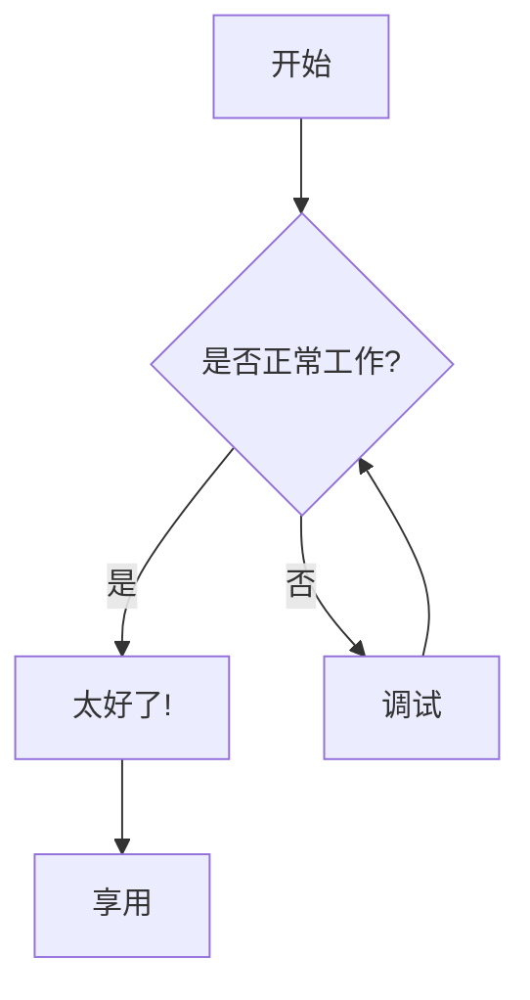

# Mermaid 图表查看器

一个基于 Web 的 Mermaid 图表查看器，使用 Next.js 和 Mermaid.js 构建。

> **English Version**: [README.md](./README.md)

## 关于 Mermaid 图表查看器

Mermaid 图表查看器是一个轻量级 Web 应用程序，允许您通过 URL 参数查看和分享 Mermaid 图表。它支持各种图表类型，包括流程图、序列图、类图等。

## 功能特性

- **基于 URL 的图表分享**：通过压缩内容的 URL 分享图表
- **主题支持**：在不同的 Mermaid 主题之间切换
- **响应式设计**：同时适用于桌面和移动设备
- **错误处理**：对无效的图表语法提供友好的错误信息
- **深色模式支持**：与系统主题偏好无缝集成

## 技术栈

本项目使用了现代化的前端技术栈：

- **[Next.js 15](https://nextjs.org)** - React 全栈框架
- **[React 19](https://react.dev)** - 用户界面库
- **[TypeScript](https://www.typescriptlang.org)** - 类型安全的 JavaScript
- **[Tailwind CSS v4](https://tailwindcss.com)** - 实用程序优先的 CSS 框架
- **[shadcn/ui](https://ui.shadcn.com)** - 可复制粘贴的组件库
- **[Mermaid.js](https://mermaid.js.org/)** - 基于 JavaScript 的图表和制图工具
- **[Pako.js](https://github.com/nodeca/pako)** - JavaScript 版的 zlib 实现，用于内容压缩

## 工作原理

1. **URL 参数解析**：应用程序从 URL 中读取 `pako` 参数
2. **内容解压缩**：使用 Pako.js 解压缩内容
3. **图表渲染**：Mermaid.js 根据解压缩的内容渲染图表
4. **主题应用**：根据选择的主题为图表设置样式

### URL 参数

- `pako`：Base64 编码的压缩 Mermaid 图表内容
- `theme`：Mermaid 主题名称（default、dark、forest、neutral、base）
- `darkMode`：深色模式偏好的布尔标志

## 使用示例

### 基本 URL 结构

```
https://your-domain.com/?pako=<compressed-content>&theme=dark
```

### 示例图表



## 开发指南

### 前提条件

- Node.js 18.0.0 或更高版本
- pnpm（推荐的包管理器）

### 快速开始

首先，安装依赖：

```bash
# 使用 pnpm（推荐）
pnpm install
```

然后，运行开发服务器：

```bash
pnpm dev
```

在浏览器中打开 [http://localhost:3000](http://localhost:3000) 查看结果。

### 项目结构

- `/app`：Next.js 应用程序页面
- `/components`：React 组件，包括 Mermaid 查看器
- `/hooks`：用于 Mermaid 渲染的自定义 React hooks
- `/types`：TypeScript 类型定义
- `/utils`：用于 URL 解析和内容压缩的工具函数

## 路线图

- [ ] 图表的缩放和平移控制
- [ ] 导出为 SVG/PNG/JPG
- [ ] 复制图表源代码
- [ ] AI 驱动的语法纠正
- [ ] 增强的分享选项
- [ ] 移动触控交互

## 了解更多

- [Mermaid.js 文档](https://mermaid.js.org/intro/) - 了解 Mermaid 图表语法
- [Next.js 文档](https://nextjs.org/docs) - 了解 Next.js 功能和 API
- [Pako.js 文档](https://github.com/nodeca/pako) - 了解 JavaScript 中的 zlib 压缩

## 部署到 Vercel

部署 Next.js 应用程序最简单的方法是使用 Next.js 创建者提供的 [Vercel 平台](https://vercel.com/new?utm_medium=default-template&filter=next.js&utm_source=create-next-app&utm_campaign=create-next-app-readme)。

查看我们的 [Next.js 部署文档](https://nextjs.org/docs/app/building-your-application/deploying) 了解更多详细信息。

---

**愉快地绘制图表吧！📊**