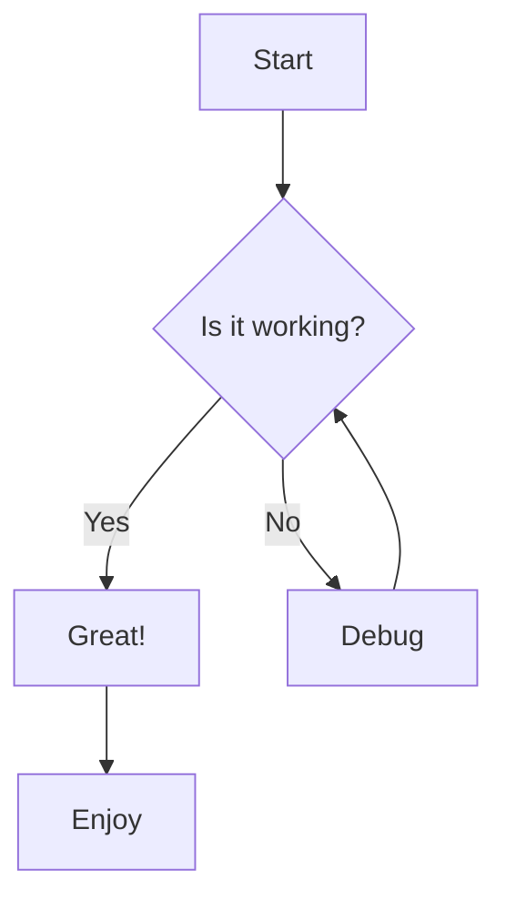

# Mermaid Chart Viewer

A web-based viewer for Mermaid diagrams, built with Next.js and Mermaid.js.

> **中文版本**: [README-zh.md](./README-zh.md)

## About Mermaid Chart Viewer

Mermaid Chart Viewer is a lightweight web application that allows you to view and share Mermaid diagrams through URL parameters. It supports various diagram types including flowcharts, sequence diagrams, class diagrams, and more.

## Features

- **URL-based Diagram Sharing**: Share diagrams via URL with compressed content
- **Theme Support**: Switch between different Mermaid themes
- **Responsive Design**: Works on both desktop and mobile devices
- **Error Handling**: Friendly error messages for invalid diagram syntax
- **Dark Mode Support**: Seamless integration with system theme preferences

## Tech Stack

This project uses a modern frontend technology stack:

- **[Next.js 15](https://nextjs.org)** - React full-stack framework
- **[React 19](https://react.dev)** - User interface library
- **[TypeScript](https://www.typescriptlang.org)** - Type-safe JavaScript
- **[Tailwind CSS v4](https://tailwindcss.com)** - Utility-first CSS framework
- **[shadcn/ui](https://ui.shadcn.com)** - Copy-paste component library
- **[Mermaid.js](https://mermaid.js.org/)** - JavaScript-based diagramming and charting tool
- **[Pako.js](https://github.com/nodeca/pako)** - zlib port to JavaScript for content compression

## How It Works

1. **URL Parameter Parsing**: The application reads the `pako` parameter from the URL
2. **Content Decompression**: Compressed content is decompressed using Pako.js
3. **Diagram Rendering**: Mermaid.js renders the diagram based on the decompressed content
4. **Theme Application**: The diagram is styled according to the selected theme

### URL Parameters

- `pako`: Base64-encoded compressed Mermaid diagram content
- `theme`: Mermaid theme name (default, dark, forest, neutral, base)
- `darkMode`: Boolean flag for dark mode preference

## Usage Examples

### Basic URL Structure

```
https://your-domain.com/?pako=<compressed-content>&theme=dark
```

### Example Diagram



## Development Guide

### Prerequisites

- Node.js 18.0.0 or higher
- pnpm (recommended package manager)

### Getting Started

First, install dependencies:

```bash
# Using pnpm (recommended)
pnpm install
```

Then, run the development server:

```bash
pnpm dev
```

Open [http://localhost:3000](http://localhost:3000) with your browser to see the result.

### Project Structure

- `/app`: Next.js application pages
- `/components`: React components including the Mermaid viewer
- `/hooks`: Custom React hooks for Mermaid rendering
- `/types`: TypeScript type definitions
- `/utils`: Utility functions for URL parsing and content compression

## Roadmap

- [ ] Zoom and pan controls for diagrams
- [ ] Export to SVG/PNG/JPG
- [ ] Copy diagram source code
- [ ] AI-powered syntax correction
- [ ] Enhanced sharing options
- [ ] Mobile touch interactions

## Learn More

- [Mermaid.js Documentation](https://mermaid.js.org/intro/) - Learn about Mermaid diagram syntax
- [Next.js Documentation](https://nextjs.org/docs) - Learn about Next.js features and API
- [Pako.js Documentation](https://github.com/nodeca/pako) - Learn about zlib compression in JavaScript

## Deploy on Vercel

The easiest way to deploy your Next.js app is to use the [Vercel Platform](https://vercel.com/new?utm_medium=default-template&filter=next.js&utm_source=create-next-app&utm_campaign=create-next-app-readme) from the creators of Next.js.

Check out our [Next.js deployment documentation](https://nextjs.org/docs/app/building-your-application/deploying) for more details.

---

**Happy Diagramming! 📊**